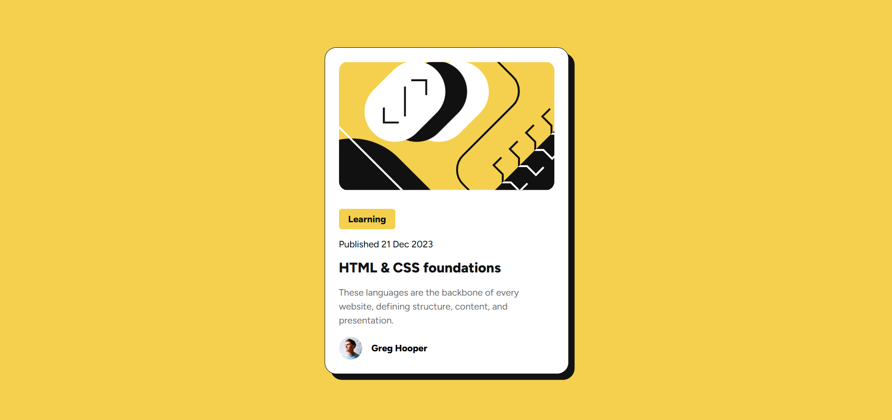
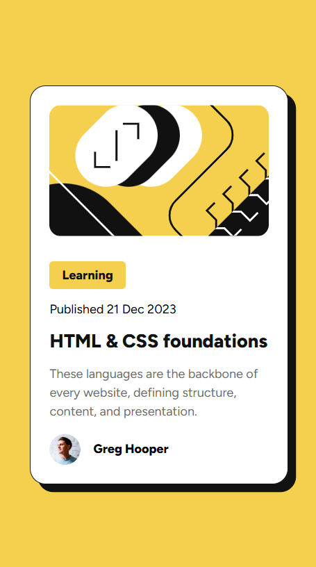

# BlogCardPreview - Frontend Mentor Challenge

The project is a single-page application featuring a centered blog preview card.
    
This project is a challenge from the Frontend Mentor website, a platform where developers can practice and improve their skills by building web applications based on provided designs. Although the project was originally intended to be built using HTML5 and CSS3, I chose to implement it using React in order to further develop my React.js skills. <a href="https://www.frontendmentor.io/challenges/blog-preview-card-ckPaj01IcS">Click here</a> to access the challenge page.

## Live Preview

[View Live Project](https://blog-preview-card-virid-xi.vercel.app/)

## Screenshots

### Desktop

    

### Mobile

    

## Features

- Use of React props to build a reusable component
- Responsive web design

## What I learned

- Gained more experience with React props
- Improved my understanding of styling React components
- Practiced implementing responsive stylesheets

## Skills

- React.js
- HTML5
- CSS3
  
## Support

If you have any questions or suggestions about this project, feel free to contact me through my GitHub profile or email <a href="mailto:developer.wesllen@gmail.com">developer.wesllen@gmail.com</a>.

## Authors

- [@WesllenCarmo](https://www.github.com/WesllenCarmo) - Web Developer

